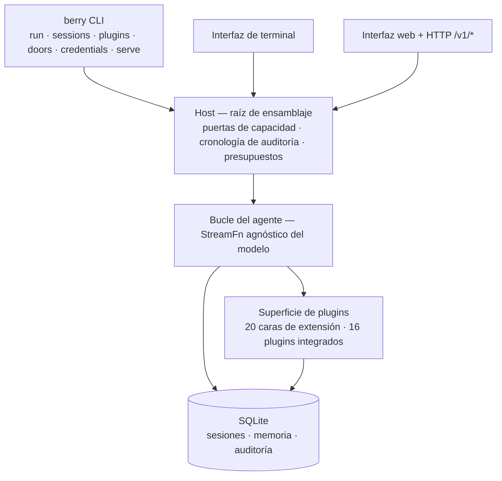

<div align="center">

# berry-agent

**Un agente personal, único y extensible para la era de la AGI — hecho para funcionar sin supervisión.**

La conversación y el código son el núcleo. Cada capacidad — shell, habilidades,
navegador, planificador, memoria, interfaz web — se carga como un **plugin**.
Los plugins oficiales y comunitarios se montan por la misma superficie; no
existe ninguna vía privada de primer partido.

<p>
  <a href="https://www.npmjs.com/package/berry-agent"></a>
  <a href="https://github.com/miuiadmin/berry-agent/actions/workflows/ci.yml"></a>
  <a href="./LICENSE"></a>
  <a href="https://www.npmjs.com/package/berry-agent"></a>
  <a href="https://nodejs.org"></a>
  <a href="https://www.typescriptlang.org"></a>
</p>

<p>
  <a href="README.md">English</a> |
  <a href="README.zh.md">简体中文</a> |
  <a href="README.ko.md">한국어</a> |
  <a href="README.fr.md">Français</a> |
  <strong>Español</strong> |
  <a href="README.ru.md">Русский</a>
</p>

**16** plugins integrados · DAG unidireccional de **28** módulos · **5.000+** tests ·
**6** contratos de publicación verificados por máquina · **0** telemetría

> Estado: `0.1.0-alpha.6` — guiado por contratos, construido en porciones
> verticales; la superficie de API aún puede cambiar antes de la 1.0.

</div>

---

## Por qué berry-agent

|                                          |                                                                                                                                                                                                                  |
| ---------------------------------------- | ---------------------------------------------------------------------------------------------------------------------------------------------------------------------------------------------------------------- |
| **Autónomo por diseño**                  | Ejecuciones guiadas por objetivos que no se detienen — probadas en soak durante horas y con recuperación verificada tras un `kill -9`. Menos intervención humana, autonomía total como meta.                     |
| **Todo es un plugin**                    | Shell, habilidades, fetch web, cron, objetivos, subagentes, checkpoints, memoria, MCP, LSP, navegador, interfaz web… las 16 capacidades oficiales se montan por la misma superficie que tus propias extensiones. |
| **Puertas de capacidad, no intuiciones** | Las capacidades peligrosas viven detrás de puertas explícitas — `berry doors list` muestra el estado de cada una. Instalar un plugin nunca implica concederle permisos.                                          |
| **Agnóstico del modelo**                 | Anthropic, OpenAI, Google y más detrás de una sola interfaz. Cambia de modelo con una variable de entorno, sin tocar código, sin encerrarse.                                                                     |
| **Sesiones de fiar**                     | Cada sesión vive en SQLite — fork, resume, search, reindex. Una aserción en tiempo de ejecución garantiza que lo que el modelo vio es exactamente lo que quedó registrado.                                       |
| **Tres superficies de automatización**   | La terminal para conducir, la interfaz web + HTTP `/v1/*` para supervisar, SDK y MCP para programas — un solo agente para todo tipo de consumidores.                                                             |
| **Cero telemetría** | Sin estadísticas de uso, sin informes de fallos, cero bytes enviados. Red por defecto: llamadas al modelo + tus acciones explícitas + una comprobación de versión de solo lectura al inicio interactivo del TUI (acotada, desactivable por variable de entorno) — nada más. |

## Inicio rápido

Requiere Node.js ≥ 24.

```bash
# Pruébalo sin instalar
npx berry-agent

# O instala globalmente
npm install -g berry-agent

# O el script de instalación en dos etapas (descarga primero, ejecuta después — nunca pipear curl a sh)
curl -fsSL -o install.sh https://raw.githubusercontent.com/miuiadmin/berry-agent/main/scripts/install.sh
sh install.sh
```

La instalación se completó cuando npm muestra `added N packages` — verifica
con `berry --version` (muestra la versión instalada). Las líneas amarillas
`npm warn` por el camino son avisos del ecosistema, no errores: la política de
aprobación de scripts de instalación de npm, y paquetes obsoletos hace tiempo
en lo profundo de la cadena de dependencias del proveedor de modelos
(p. ej. `node-domexception`). berry-agent en sí no incluye ningún script de
instalación (el enlace SQLite viene precompilado — no se compila nada), así
que el modo más estricto `npm install -g --ignore-scripts berry-agent` se
comporta igual y silencia los avisos de scripts.

Una vez instalado, el comando es **`berry`**:

```bash
berry                    # TUI: entra directamente en conversación (retoma la última sesión del directorio actual)
berry run "tarea única"  # ejecución única → stdout
berry sessions list      # sesiones: list / resume / fork / search / reindex / export
berry plugins list       # plugins: list / check / install / uninstall / mount / unmount / toggle / update
berry credentials list   # credenciales: add / list / rm (la TUI también tiene flujo OAuth)
berry doors list         # estado de las puertas de capacidad (solo lectura)
berry serve --port 7860  # host residente: interfaz web + superficie programática /v1/*
```

¿Actualizas desde alpha.1? El binario pasó a llamarse `berry` — corte limpio
sin alias de doble nombre: al actualizar, npm reemplaza automáticamente el
antiguo enlace `berry-agent` por `berry` y el antiguo nombre de comando deja de
funcionar; pasa tus scripts a `berry`.

El primer arranque crea `~/.berry-agent/`. El modelo por defecto es
`anthropic/claude-sonnet-5` (proporciona `ANTHROPIC_API_KEY`); sobrescríbelo con
`BERRY_AGENT_MODEL`. La referencia completa de comandos, banderas y variables de
entorno está en la [guía de uso](./docs/usage.md) (en chino).

## Los 16 plugins integrados

Todos se envían con el paquete; 15 están activados por defecto y cada uno
puede desactivarse individualmente — `core:issue` solo se carga una vez
configurado (consulta la guía de uso).

| Plugin             | Aporta                                                      |
| ------------------ | ----------------------------------------------------------- |
| `core:exec`        | ejecución de shell                                          |
| `core:skills`      | paquetes de habilidades (`SKILL.md`)                        |
| `core:web`         | fetch web                                                   |
| `core:scheduler`   | tareas programadas estilo cron                              |
| `core:goal`        | ejecuciones continuas guiadas por objetivos                 |
| `core:subagent`    | subagentes aislados                                         |
| `core:checkpoint`  | instantáneas de frontera y rebobinado                       |
| `core:memory`      | memoria persistente                                         |
| `core:mcp`         | cliente MCP — monta servidores MCP externos                 |
| `core:lsp`         | cliente LSP — inteligencia de servidores de lenguaje        |
| `core:browser`     | automatización del navegador                                |
| `core:webui`       | panel web                                                   |
| `core:sdk`         | el canal de automatización para programas                   |
| `core:obs`         | observabilidad                                              |
| `core:issue`       | modo de trabajo guiado por issues                           |
| `core:credentials` | bóveda de credenciales — inyección env y flujo OAuth device |

Escribe el tuyo: un plugin es un manifiesto más un archivo de entrada — consulta la
[guía de desarrollo de plugins](./docs/plugin-development.md) (en chino) y los
[ejemplos](./examples) incluidos en el repositorio.

## Canales de automatización

- **HTTP** — `berry serve` arranca un host residente con la interfaz web y
  una API JSON `/v1/*` versionada y autenticada por bearer; `serve --daemon` lo
  ejecuta en segundo plano (`serve status` / `serve stop`).
- **SDK** — un cliente TypeScript tipado (spawn stdio o HTTP directo) vive en el
  repositorio; el paquete npm `berry-agent-sdk` ya está en npm en fase alfa
  (`npm install berry-agent-sdk` lo instala directamente) y evoluciona con el
  repositorio principal.
- **MCP** — `berry mcp` expone el agente como servidor MCP, para que
  cualquier cliente MCP pueda conducirlo.

## Arquitectura

El mecanismo en el sustrato, la política en los plugins: el host es dueño de los
puntos de extensión, hooks, eventos y barreras de seguridad; las capacidades se
expresan como plugins. Los 28 módulos forman un DAG unidireccional — la dirección
de cada dependencia está [impuesta por máquina](./docs/architecture.md) (en chino).



## Documentación

Los cinco volmenes están escritos actualmente en chino:

| Volumen                                               | Cubre                                                              |
| ----------------------------------------------------- | ------------------------------------------------------------------ |
| [Arquitectura](./docs/architecture.md)                | capas, topología de módulos, ejecución, modelo de seguridad        |
| [Guía de uso](./docs/usage.md)                        | instalación, comandos, TUI, variables de entorno                   |
| [Desarrollo de plugins](./docs/plugin-development.md) | manifiesto, capacidades ctx, puntos de extensión                   |
| [Guía de desarrollo](./docs/development.md)           | barreras, ley de topología, disciplina de tests, contribución      |
| [Manual de operaciones](./docs/operations.md)         | directorio de datos, copia y restauración, resolución de problemas |

## Desarrollo

```bash
npm install
npm run typecheck       # barrera 1: tsc --noEmit
npm test                # barrera 2: vitest run
npm run lint:topology   # barrera 3: DAG de módulos + snapshot de API + vocabulario
npm run format:check    # barrera 4: prettier
npm run build           # cadena de build (webui → tsc → snapshot de declaraciones API)
```

Las cuatro barreras pasan en verde en CI en cada push. Para participar, consulta la
[guía de desarrollo](./docs/development.md) y [CONTRIBUTING.md](./CONTRIBUTING.md);
reporta vulnerabilidades vía [SECURITY.md](./SECURITY.md).

## Licencia

[MIT](./LICENSE)
