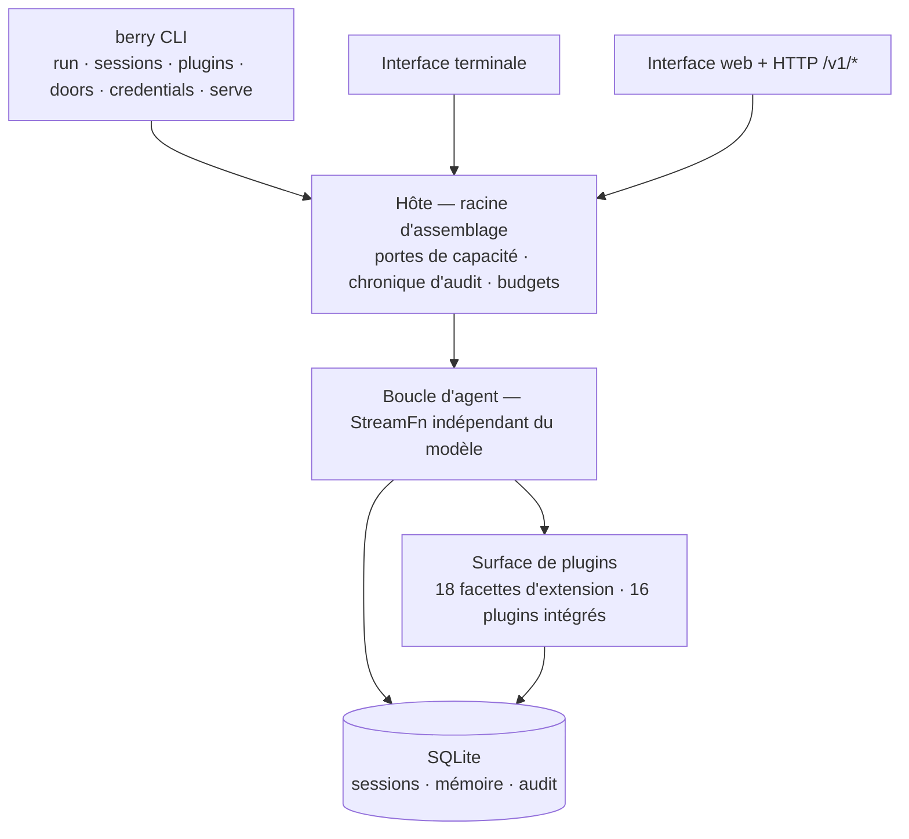

<div align="center">

# berry-agent

**Un agent personnel unique et extensible pour l'ère de l'AGI — conçu pour tourner sans surveillance.**

La conversation et le code sont le cœur. Chaque capacité — shell, compétences,
navigateur, planificateur, mémoire, interface web — se charge comme un
**plugin**. Les plugins officiels et communautaires empruntent la même surface
de montage ; il n'existe aucune voie privée de premier parti.

<p>
  <a href="https://www.npmjs.com/package/berry-agent"></a>
  <a href="https://github.com/miuiadmin/berry-agent/actions/workflows/ci.yml"></a>
  <a href="./LICENSE"></a>
  <a href="https://www.npmjs.com/package/berry-agent"></a>
  <a href="https://nodejs.org"></a>
  <a href="https://www.typescriptlang.org"></a>
</p>

<p>
  <a href="README.md">English</a> |
  <a href="README.zh.md">简体中文</a> |
  <a href="README.ko.md">한국어</a> |
  <strong>Français</strong> |
  <a href="README.es.md">Español</a> |
  <a href="README.ru.md">Русский</a>
</p>

**16** plugins intégrés · DAG unidirectionnel de **28** modules · **4 000+** tests ·
**6** contrats de publication vérifiés par la machine · **0** télémétrie

> Statut : `0.1.0-alpha.2` — piloté par les contrats, construit par tranches
> verticales ; la surface d'API peut encore évoluer avant la 1.0.

</div>

---

## Pourquoi berry-agent

|                                              |                                                                                                                                                                                                                            |
| -------------------------------------------- | -------------------------------------------------------------------------------------------------------------------------------------------------------------------------------------------------------------------------- |
| **Autonome par conception**                  | Des exécutions pilotées par objectif qui ne s'arrêtent pas — testées en continu pendant des heures, récupération vérifiée après un `kill -9`. Moins d'intervention humaine, l'autonomie complète pour objectif.            |
| **Tout est plugin**                          | Shell, compétences, récupération web, cron, objectifs, sous-agents, points de contrôle, mémoire, MCP, LSP, navigateur, interface web… les 16 capacités officielles passent par la même surface que vos propres extensions. |
| **Des portes de capacité, rien d'implicite** | Les capacités dangereuses vivent derrière des portes explicites — `berry doors list` affiche l'état de chacune. Installer un plugin n'implique jamais l'octroi de permissions.                                             |
| **Agnostique du modèle**                     | Anthropic, OpenAI, Google et d'autres derrière une seule interface. Changez de modèle avec une variable d'environnement, sans toucher au code, sans enfermement.                                                           |
| **Des sessions fiables**                     | Chaque session vit dans SQLite — fork, resume, search, reindex. Une assertion à l'exécution garantit que ce que le modèle a vu est exactement ce qui a été enregistré.                                                     |
| **Trois surfaces d'automatisation**          | L'interface terminale pour piloter, l'interface web + HTTP `/v1/*` pour superviser, SDK & MCP pour les programmes — un seul agent, tous les consommateurs.                                                                 |
| **Zéro télémétrie**                          | Pas de statistiques d'usage, pas de rapports de plantage, pas d'appel de vérification de version. La surface réseau par défaut : les appels de modèle et ce que vous demandez explicitement — rien d'autre.                |

## Démarrage rapide

Nécessite Node.js ≥ 24.

```bash
# Essayer sans installer
npx berry-agent

# Ou installer globalement
npm install -g berry-agent

# Ou le script d'installation en deux étapes (télécharger d'abord, exécuter ensuite — ne pipez jamais curl dans sh)
curl -fsSL -o install.sh https://raw.githubusercontent.com/miuiadmin/berry-agent/main/scripts/install.sh
sh install.sh
```

Une fois installé, la commande est **`berry`** :

```bash
berry                    # TUI : plongez directement dans la conversation (reprend la dernière session du répertoire courant)
berry run "one-shot"     # exécution unique → stdout
berry sessions list      # sessions : list / resume / fork / search / reindex
berry plugins list       # plugins : list / check / install / uninstall / mount / unmount / toggle / update
berry credentials list   # identifiants : add / list / rm (le TUI propose aussi un flux OAuth)
berry doors list         # état des portes de capacité (lecture seule)
berry serve --port 7860  # hôte résident : interface web + surface programmatique /v1/*
```

Vous mettez à niveau depuis alpha.1 ? Le nom du binaire est désormais `berry` —
coupe nette sans alias à double nom : la mise à niveau npm remplace
automatiquement l'ancien lien `berry-agent` par `berry`, l'ancien nom de
commande cesse de fonctionner ; adaptez vos scripts pour utiliser `berry`.

Le premier lancement crée `~/.berry-agent/`. Le modèle par défaut est
`anthropic/claude-sonnet-5` (fournissez `ANTHROPIC_API_KEY`) ; surchargez avec
`BERRY_AGENT_MODEL`. La référence complète des commandes, drapeaux et variables
d'environnement se trouve dans le [guide d'utilisation](./docs/usage.md) (en chinois).

## Les 16 plugins intégrés

Tous livrés avec le paquet ; 15 sont activés par défaut et chacun peut être
désactivé individuellement — `core:issue` ne se charge qu'une fois configuré
(voir le guide d'utilisation).

| Plugin             | Apporte                                                   |
| ------------------ | --------------------------------------------------------- |
| `core:exec`        | exécution shell                                           |
| `core:skills`      | packs de compétences (`SKILL.md`)                         |
| `core:web`         | récupération web                                          |
| `core:scheduler`   | tâches planifiées façon cron                              |
| `core:goal`        | exécutions continues pilotées par objectif                |
| `core:subagent`    | sous-agents isolés                                        |
| `core:checkpoint`  | instantanés de frontière & retour arrière                 |
| `core:memory`      | mémoire persistante                                       |
| `core:mcp`         | client MCP — monter des serveurs MCP externes             |
| `core:lsp`         | client LSP — intelligence des serveurs de langage         |
| `core:browser`     | automatisation du navigateur                              |
| `core:webui`       | tableau de bord web                                       |
| `core:sdk`         | le canal d'automatisation pour les programmes             |
| `core:obs`         | observabilité                                             |
| `core:issue`       | mode de travail piloté par les tickets                    |
| `core:credentials` | coffre d'identifiants — injection env & flux OAuth device |

Écrire le vôtre : un plugin, c'est un manifeste plus un fichier d'entrée — voir le
[guide de développement de plugins](./docs/plugin-development.md) (en chinois) et les
[exemples](./examples) livrés dans le dépôt.

## Canaux d'automatisation

- **HTTP** — `berry serve` démarre un hôte résident avec l'interface web et
  une API JSON `/v1/*` versionnée et authentifiée par bearer ; `serve --daemon`
  le lance en arrière-plan (`serve status` / `serve stop`).
- **SDK** — un client TypeScript typé (spawn stdio ou HTTP direct) vit dans le
  dépôt ; le paquet npm `berry-agent-sdk` arrive avec la bêta.
- **MCP** — `berry mcp` expose l'agent comme serveur MCP, pilotable par
  n'importe quel client MCP.

## Architecture

Le mécanisme dans le substrat, la politique dans les plugins : l'hôte possède
points d'extension, hooks, événements et barrières de sécurité ; les capacités
s'expriment en plugins. Les 28 modules forment un DAG unidirectionnel — la
direction de chaque dépendance est [appliquée par la
machine](./docs/architecture.md) (en chinois).



## Documentation

Les cinq volumes sont actuellement rédigés en chinois :

| Volume                                                   | Couvre                                                        |
| -------------------------------------------------------- | ------------------------------------------------------------- |
| [Architecture](./docs/architecture.md)                   | couches, topologie des modules, exécution, modèle de sûreté   |
| [Guide d'utilisation](./docs/usage.md)                   | installation, commandes, TUI, variables d'environnement       |
| [Développement de plugins](./docs/plugin-development.md) | manifeste, capacités ctx, points d'extension                  |
| [Guide de développement](./docs/development.md)          | barrières, loi de topologie, discipline de test, contribution |
| [Manuel d'exploitation](./docs/operations.md)            | répertoire de données, sauvegarde & restauration, dépannage   |

## Développement

```bash
npm install
npm run typecheck       # barrière 1 : tsc --noEmit
npm test                # barrière 2 : vitest run
npm run lint:topology   # barrière 3 : DAG des modules + snapshot API + vocabulaire
npm run format:check    # barrière 4 : prettier
npm run build           # chaîne de build (webui → tsc → snapshot des déclarations API)
```

Les quatre barrières passent au vert en CI à chaque push. Pour contribuer, voir le
[guide de développement](./docs/development.md) et [CONTRIBUTING.md](./CONTRIBUTING.md) ;
signalez les vulnérabilités via [SECURITY.md](./SECURITY.md).

## Licence

[MIT](./LICENSE)
