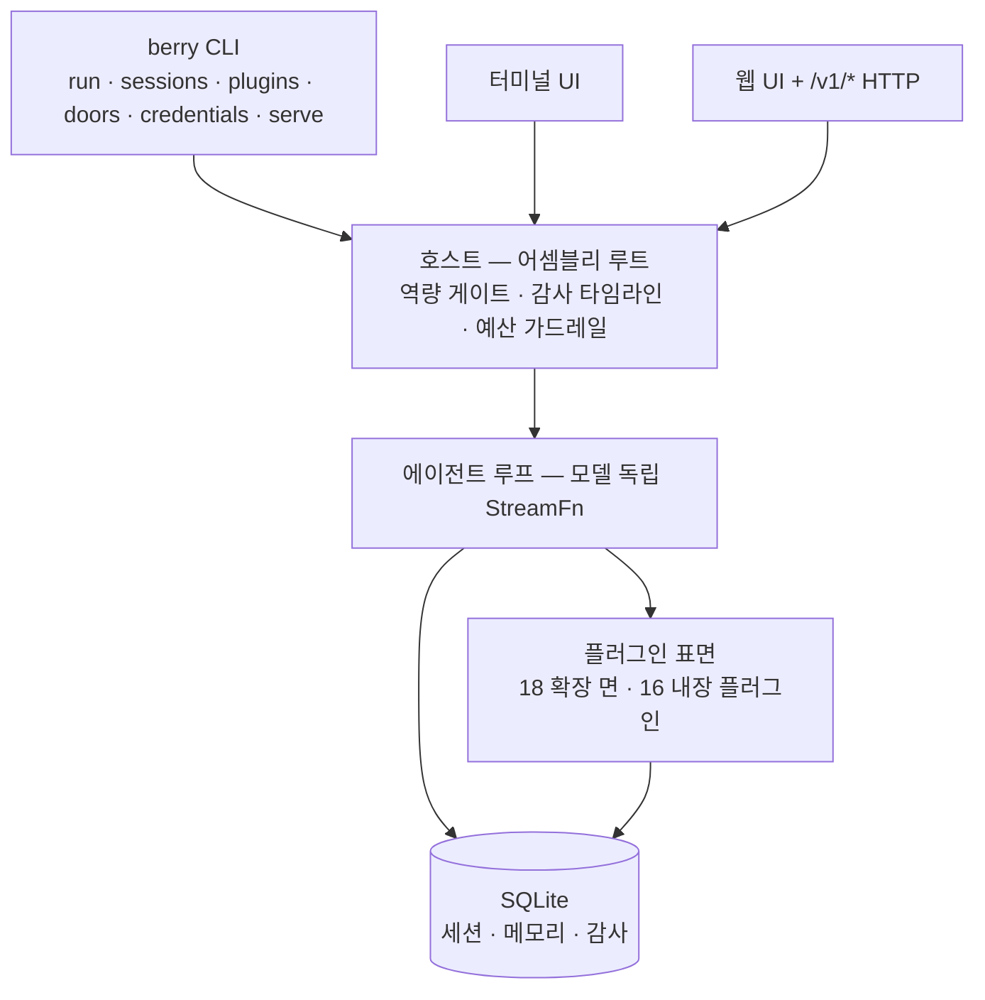

<div align="center">

# berry-agent

**AGI 시대를 위한 무인운용 자동화 에이전트 — 단일하고 확장 가능한 개인 에이전트.**

대화와 코딩이 본체입니다. 셸, 스킬, 브라우저, 스케줄러, 메모리, 웹 UI —
모든 기능이 **플러그인**으로 장착됩니다. 공식 플러그인과 커뮤니티 플러그인은
같은 장착면을 사용하며, 퍼스트파티 전용 차로는 존재하지 않습니다.

<p>
  <a href="https://www.npmjs.com/package/berry-agent"></a>
  <a href="https://github.com/miuiadmin/berry-agent/actions/workflows/ci.yml"></a>
  <a href="./LICENSE"></a>
  <a href="https://www.npmjs.com/package/berry-agent"></a>
  <a href="https://nodejs.org"></a>
  <a href="https://www.typescriptlang.org"></a>
</p>

<p>
  <a href="README.md">English</a> |
  <a href="README.zh.md">简体中文</a> |
  <strong>한국어</strong> |
  <a href="README.fr.md">Français</a> |
  <a href="README.es.md">Español</a> |
  <a href="README.ru.md">Русский</a>
</p>

**16**개 내장 플러그인 · **28**모듈 단방향 DAG · **4,000+** 테스트 ·
**6**개의 기계 검증 릴리스 계약 · **0** 텔레메트리

> 상태: `0.1.0-alpha.2` — 계약 선행, 수직 슬라이스로 구축; 1.0 이전에는 API
> 표면이 변경될 수 있습니다.

</div>

---

## 왜 berry-agent인가

|                           |                                                                                                                                                        |
| ------------------------- | ------------------------------------------------------------------------------------------------------------------------------------------------------ |
| **무인운용 설계**         | 목표 기반 실행이 멈추지 않습니다 — 시간 단위 soak 테스트와 `kill -9` 강제 종료 후 복구 검증 완료. 개입은 줄이고, 완전 자율화가 목표입니다.             |
| **모든 것이 플러그인**    | 셸, 스킬, 웹 페치, cron, 목표, 서브에이전트, 체크포인트, 메모리, MCP, LSP, 브라우저, 웹 UI… 16개 공식 기능이 여러분의 확장과 같은 장착면을 사용합니다. |
| **감이 아닌 역량 게이트** | 위험한 기능은 명시적 게이트 뒤에 있습니다 — `berry doors list`로 각 상태를 확인하세요. 플러그인 설치는 권한 부여를 의미하지 않습니다.                  |
| **모델 독립적**           | Anthropic, OpenAI, Google 등이 하나의 인터페이스 뒤에 있습니다. 환경변수 하나로 모델 교체, 코드 변경 없음, 락인 없음.                                  |
| **신뢰할 수 있는 세션**   | 모든 세션은 SQLite에 저장 — fork, resume, search, reindex. 런타임 어설션이 "모델이 본 것 = 기록된 것"을 보장합니다.                                    |
| **세 가지 자동화 표면**   | 구동하는 터미널 UI, 감독하는 웹 UI + `/v1/*` HTTP, 프로그램을 위한 SDK & MCP — 하나의 에이전트로 모든 소비자를 수용합니다.                             |
| **제로 텔레메트리**       | 사용 통계 없음, 크래시 리포트 없음, 버전 확인 콜백 없음. 기본 네트워크 표면은 모델 호출과 명시적 요청뿐입니다.                                         |

## 빠른 시작

Node.js ≥ 24 필요.

```bash
# 설치 없이 체험
npx berry-agent

# 전역 설치
npm install -g berry-agent

# 또는 2단계 설치 스크립트 (먼저 다운로드한 후 실행 — curl을 sh로 직접 파이프하지 마세요)
curl -fsSL -o install.sh https://raw.githubusercontent.com/miuiadmin/berry-agent/main/scripts/install.sh
sh install.sh
```

설치 후 명령어는 **`berry`**입니다:

```bash
berry                    # TUI: 바로 대화 시작 (현재 디렉터리의 최신 세션 이어가기)
berry run "원샷 실행"     # 단일 실행 → stdout
berry sessions list      # 세션: list / resume / fork / search / reindex
berry plugins list       # 플러그인: list / check / install / uninstall / mount / unmount / toggle / update
berry credentials list   # 자격증명: add / list / rm (TUI에는 OAuth 흐름도 있음)
berry doors list         # 역량 게이트 상태 (읽기 전용)
berry serve --port 7860  # 상주 호스트: 웹 UI + /v1/* 프로그래밍 표면
```

alpha.1에서 업그레이드한 사용자: bin 이름이 `berry`로 바뀌었습니다. 이중
이름 별칭 없이 깔끔하게 전환됩니다. npm 업그레이드 시 이전 링크 `berry-agent`는
자동으로 `berry`로 재연결되어 이전 명령어는 더 이상 동작하지 않으므로, 스크립트는
`berry`로 변경하세요.

첫 실행 시 `~/.berry-agent/`가 생성됩니다. 기본 모델은
`anthropic/claude-sonnet-5` (`ANTHROPIC_API_KEY` 제공), `BERRY_AGENT_MODEL`로
덮어쓸 수 있습니다. 전체 명령·플래그·환경변수 참조는 [사용 가이드](./docs/usage.md)(중국어)에 있습니다.

## 내장 플러그인 16개

16개 모두 패키지에 포함되어 있으며, 그중 15개는 기본 활성화되어 개별적으로
비활성화할 수 있습니다. `core:issue`는 설정 후에만 로드됩니다(사용 가이드 참조).

| 플러그인           | 제공 기능                                      |
| ------------------ | ---------------------------------------------- |
| `core:exec`        | 셸 실행                                        |
| `core:skills`      | 스킬 팩 (`SKILL.md`)                           |
| `core:web`         | 웹 페치                                        |
| `core:scheduler`   | cron 방식 예약 작업                            |
| `core:goal`        | 목표 기반 연속 실행                            |
| `core:subagent`    | 격리된 서브에이전트                            |
| `core:checkpoint`  | 경계 스냅샷 & 되감기                           |
| `core:memory`      | 영구 메모리                                    |
| `core:mcp`         | MCP 클라이언트 — 외부 MCP 서버 장착            |
| `core:lsp`         | LSP 클라이언트 — 언어 서버 지능                |
| `core:browser`     | 브라우저 자동화                                |
| `core:webui`       | 웹 대시보드                                    |
| `core:sdk`         | 프로그램용 자동화 채널                         |
| `core:obs`         | 관측 가능성                                    |
| `core:issue`       | 이슈 기반 작업 모드                            |
| `core:credentials` | 자격증명 금고 — env 주입 & OAuth 디바이스 흐름 |

직접 만들기: 플러그인은 manifest 하나와 엔트리 파일 하나 —
[플러그인 개발 가이드](./docs/plugin-development.md)(중국어)와 저장소에 포함된
[examples](./examples)를 참고하세요.

## 자동화 채널

- **HTTP** — `berry serve`는 웹 UI와 버전 관리되는 Bearer 인증 `/v1/*`
  JSON API를 갖춘 상주 호스트를 시작합니다; `serve --daemon`으로 백그라운드
  실행 (`serve status` / `serve stop`).
- **SDK** — 타입스크립트 클라이언트(stdio 스폰 또는 직접 HTTP)가 저장소에
  포함되어 있습니다; `berry-agent-sdk` npm 패키지는 알파 단계로 npm에 등록되어
  있으며 본 저장소와 함께 발전합니다.
- **MCP** — `berry mcp`는 에이전트를 MCP 서버로 노출하여 모든 MCP
  클라이언트가 구동할 수 있습니다.

## 아키텍처

메커니즘은 기반에, 정책은 플러그인에: 호스트는 확장점·훅·이벤트·안전 게이트를
소유하고, 기능은 플러그인으로 표현됩니다. 28개 모듈은 단방향 DAG를 이루며 —
모든 의존성 방향은 [기계적으로 강제](./docs/architecture.md)됩니다(중국어).



## 문서

다섯 권 모두 현재 중국어로 작성되어 있습니다:

| 권                                            | 내용                                     |
| --------------------------------------------- | ---------------------------------------- |
| [아키텍처](./docs/architecture.md)            | 계층, 모듈 토폴로지, 런타임, 안전 모델   |
| [사용 가이드](./docs/usage.md)                | 설치, 명령, TUI, 환경변수                |
| [플러그인 개발](./docs/plugin-development.md) | manifest, ctx 역량, 확장점               |
| [개발 가이드](./docs/development.md)          | 게이트, 토폴로지 법칙, 테스트 규율, 기여 |
| [운영 매뉴얼](./docs/operations.md)           | 데이터 디렉터리, 백업 & 복원, 문제 해결  |

## 개발

```bash
npm install
npm run typecheck       # 게이트 1: tsc --noEmit
npm test                # 게이트 2: vitest run
npm run lint:topology   # 게이트 3: 모듈 DAG + API 스냅샷 + 어휘 게이트
npm run format:check    # 게이트 4: prettier
npm run build           # 빌드 체인 (webui → tsc → API 선언 스냅샷)
```

네 게이트는 매 푸시마다 CI에서 전부 통과합니다. 참여는 [개발 가이드](./docs/development.md)와
[CONTRIBUTING.md](./CONTRIBUTING.md)를, 취약점 신고는 [SECURITY.md](./SECURITY.md)를 참고하세요.

## 라이선스

[MIT](./LICENSE)
