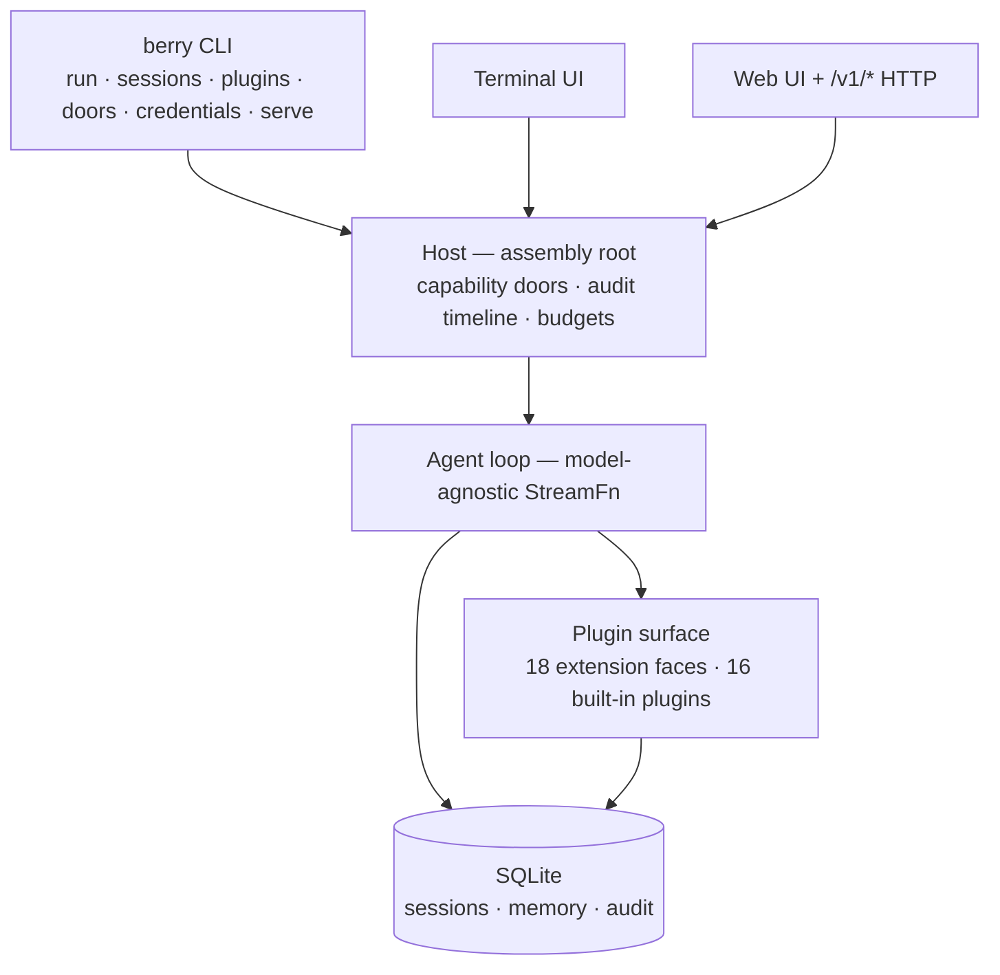

<div align="center">

# berry-agent

**A single, extensible personal agent for the AGI era — built to run unattended.**

Chat and coding are the core. Every capability — shell, skills, browser, scheduler,
memory, web UI — loads as a **plugin**. Official and community plugins mount through
the same surface; there is no first-class private lane.

<p>
  <a href="https://www.npmjs.com/package/berry-agent"></a>
  <a href="https://github.com/miuiadmin/berry-agent/actions/workflows/ci.yml"></a>
  <a href="./LICENSE"></a>
  <a href="https://www.npmjs.com/package/berry-agent"></a>
  <a href="https://nodejs.org"></a>
  <a href="https://www.typescriptlang.org"></a>
</p>

<p>
  <strong>English</strong> |
  <a href="README.zh.md">简体中文</a> |
  <a href="README.ko.md">한국어</a> |
  <a href="README.fr.md">Français</a> |
  <a href="README.es.md">Español</a> |
  <a href="README.ru.md">Русский</a>
</p>

**16** built-in plugins · **28**-module one-way DAG · **4,000+** tests ·
**6** machine-checked release contracts · **0** telemetry

> Status: `0.1.0-alpha.2` — contract-first, built in vertical slices; the API surface
> may still shift before 1.0.

</div>

---

## Why berry-agent

|                                 |                                                                                                                                                                                         |
| ------------------------------- | --------------------------------------------------------------------------------------------------------------------------------------------------------------------------------------- |
| **Unattended by design**        | Goal-driven runs that keep going — soak-tested for hours and verified to recover after a hard `kill -9`. Less human intervention, full autonomy as the goal.                            |
| **Everything is a plugin**      | Shell, skills, web fetch, cron, goals, sub-agents, checkpoints, memory, MCP, LSP, browser, web UI… all 16 official capabilities mount through the same surface your own extensions use. |
| **Capability doors, not vibes** | Dangerous capabilities sit behind explicit doors — `berry doors list` shows each one's state. Installing a plugin never implies granting it permissions.                                |
| **Model-agnostic**              | Anthropic, OpenAI, Google and more behind one interface. Switch with one env var, no code changes, no lock-in.                                                                          |
| **Sessions you can trust**      | Every session lives in SQLite — fork, resume, search, reindex. A runtime assertion guarantees that what the model saw is exactly what got recorded.                                     |
| **Three automation surfaces**   | Terminal UI for driving, Web UI + `/v1/*` HTTP for supervising, SDK & MCP for programs — one agent, every kind of consumer.                                                             |
| **Zero telemetry**              | No usage stats, no crash reports, no phone-home version checks. The default network surface is model calls plus what you explicitly ask for — nothing else.                             |

## Quickstart

Requires Node.js ≥ 24.

```bash
# Try it without installing
npx berry-agent

# Or install globally
npm install -g berry-agent

# Or the two-stage install script (download first, then run — never pipe curl into sh)
curl -fsSL -o install.sh https://raw.githubusercontent.com/miuiadmin/berry-agent/main/scripts/install.sh
sh install.sh
```

Once installed, the command is **`berry`**:

```bash
berry                    # TUI: jump straight into a conversation (continues the latest session in the current directory)
berry run "one shot"     # single execution → stdout
berry sessions list      # sessions: list / resume / fork / search / reindex
berry plugins list       # plugins: list / check / install / uninstall / mount / unmount / toggle / update
berry credentials list   # credentials: add / list / rm (the TUI also has an OAuth flow)
berry doors list         # capability-door state (read-only)
berry serve --port 7860  # resident host: Web UI + /v1/* programmatic surface
```

Upgrading from alpha.1? The bin name is now `berry` — a clean cut with no
dual-name alias: the npm upgrade replaces the old `berry-agent` link with
`berry` automatically, and the old command name stops working, so switch any
scripts over to `berry`.

The first run creates `~/.berry-agent/`. The default model is `anthropic/claude-sonnet-5`
(supply `ANTHROPIC_API_KEY`); override with `BERRY_AGENT_MODEL`. The full command,
flag and environment-variable reference lives in the [usage guide](./docs/usage.md) (Chinese).

## The 16 built-in plugins

All ship with the package; 15 are enabled by default and each can be
disabled individually — `core:issue` only loads once configured (see the
usage guide).

| Plugin             | Brings you                                           |
| ------------------ | ---------------------------------------------------- |
| `core:exec`        | shell execution                                      |
| `core:skills`      | skill packs (`SKILL.md`)                             |
| `core:web`         | web fetch                                            |
| `core:scheduler`   | cron-style scheduled jobs                            |
| `core:goal`        | goal-driven continuous runs                          |
| `core:subagent`    | isolated sub-agents                                  |
| `core:checkpoint`  | boundary snapshots & rewind                          |
| `core:memory`      | persistent memory                                    |
| `core:mcp`         | MCP client — mount external MCP servers              |
| `core:lsp`         | LSP client — language-server intelligence            |
| `core:browser`     | browser automation                                   |
| `core:webui`       | web dashboard                                        |
| `core:sdk`         | the automation channel for programs                  |
| `core:obs`         | observability                                        |
| `core:issue`       | issue-driven work mode                               |
| `core:credentials` | credential vault — env injection & OAuth device flow |

Writing your own: a plugin is a manifest plus one entry file — see the
[plugin development guide](./docs/plugin-development.md) (Chinese) and the
[examples](./examples) shipped in the repository.

## Automation channels

- **HTTP** — `berry serve` starts a resident host with the Web UI and a
  versioned, bearer-authenticated `/v1/*` JSON API; `serve --daemon` runs it in the
  background (`serve status` / `serve stop`).
- **SDK** — a typed TypeScript client (stdio spawn or direct HTTP) lives in the
  repository; the `berry-agent-sdk` npm package lands with the beta.
- **MCP** — `berry mcp` exposes the agent as an MCP server, so any MCP
  client can drive it.

## Architecture

Mechanism in the substrate, policy in the plugins: the host owns extension points,
hooks, events and safety gates; capabilities are expressed as plugins. The 28
modules form a one-way DAG — the direction of every dependency is
[machine-enforced](./docs/architecture.md) (Chinese).



## Documentation

All five volumes are currently written in Chinese:

| Volume                                             | Covers                                             |
| -------------------------------------------------- | -------------------------------------------------- |
| [Architecture](./docs/architecture.md)             | layering, module topology, runtime, safety model   |
| [Usage guide](./docs/usage.md)                     | install, commands, TUI, environment variables      |
| [Plugin development](./docs/plugin-development.md) | manifest, ctx capabilities, extension points       |
| [Development guide](./docs/development.md)         | gates, topology law, test discipline, contributing |
| [Operations manual](./docs/operations.md)          | data directory, backup & restore, troubleshooting  |

## Development

```bash
npm install
npm run typecheck       # gate 1: tsc --noEmit
npm test                # gate 2: vitest run
npm run lint:topology   # gate 3: module DAG + API snapshot gates
npm run format:check    # gate 4: prettier
npm run build           # build chain (webui → tsc → API declaration snapshot)
```

All four gates run green in CI on every push. See the [development guide](./docs/development.md)
and [CONTRIBUTING.md](./CONTRIBUTING.md) to get involved; report vulnerabilities
via [SECURITY.md](./SECURITY.md).

## License

[MIT](./LICENSE)
