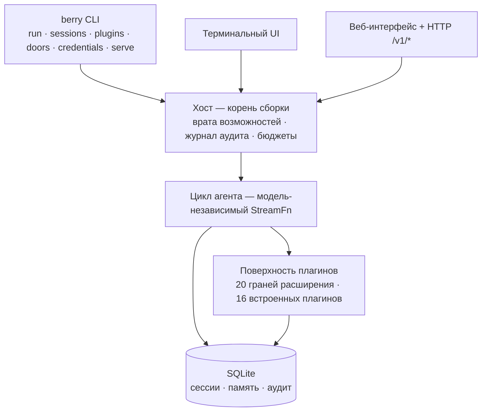

<div align="center">

# berry-agent

**Персональный агент для эпохи AGI — работает без присмотра и саморазвивается: дежурит, выдерживает долгие циклы и понимает вас лучше с каждой сессией.**

Диалог и код — это ядро. Любая возможность — shell, навыки, браузер, планировщик,
память, веб-интерфейс — загружается как **плагин**. Официальные и сторонние
плагины монтируются через одну и ту же поверхность; привилегированного
«первоклассного» пути не существует.

<p>
  <a href="https://www.npmjs.com/package/berry-agent"></a>
  <a href="https://github.com/miuiadmin/berry-agent/actions/workflows/ci.yml"></a>
  <a href="./LICENSE"></a>
  <a href="https://www.npmjs.com/package/berry-agent"></a>
  <a href="https://nodejs.org"></a>
  <a href="https://www.typescriptlang.org"></a>
</p>

<p>
  <a href="README.md">English</a> |
  <a href="README.zh.md">简体中文</a> |
  <a href="README.ko.md">한국어</a> |
  <a href="README.fr.md">Français</a> |
  <a href="README.es.md">Español</a> |
  <strong>Русский</strong>
</p>

**16** встроенных плагинов · однонаправленный DAG из **28** модулей ·
**5 000+** тестов · **6** проверяемых машиной контрактов релиза · **0** телеметрии

> Статус: `0.1.0-alpha.7` — контракт-первая разработка, постройка вертикальными
> срезами; поверхность API ещё может измениться до 1.0.

</div>

---

## Где мы стоим

AGI — искусственный общий интеллект — приближается. А за ним ждёт RSI, рекурсивное
самоулучшение: петля обратной связи, в которой улучшения системы делают её ещё
лучше в том, чтобы улучшать себя. berry-agent не является ни тем, ни другим — и не
притворяется. Это инженерный ответ на вопрос, который эта эпоха действительно задаёт:

**Когда интеллект станет дешёвым и универсальным, кто будет дежурить за вас?**

Поэтому мы поставляем саморазвитие как принцип продукта, а не как манифест. Оно
начинается с ограниченных контуров, проверяемых уже сегодня, — сессии оседают в
память, опыт оседает в навыки, каждый запуск остаётся воспроизводимым и
проверяемым, — а не с грандиозных нарративов о переписывании самого себя. Основа
владеет интерфейсами, плагины несут возможности, а эволюция касается только данных:
поверхность безопасности (врата возможностей, бюджетные ограждения, лента аудита)
принадлежит хосту и навсегда остаётся вне досягаемости эволюции.

## Почему berry-agent

|                                          |                                                                                                                                                                                                                 |
| ---------------------------------------- | --------------------------------------------------------------------------------------------------------------------------------------------------------------------------------------------------------------- |
| **Автономность по замыслу**              | Циклы, ведомые целью, которые не останавливаются — многочасовые soak-тесты и проверенное восстановление после жёсткого `kill -9`. Меньше вмешательства человека, полная автономия как цель.                     |
| **Понимает вас лучше с каждой сессией**  | Ограниченный контур саморазвития — сессии оседают в память, предпочтения и навыки; поведение улучшается с использованием. Проверяемо и стираемо: эволюция касается только данных, но никогда — поверхности безопасности. |
| **Всё — плагин**                         | Shell, навыки, веб-запросы, cron, цели, субагенты, чекпоинты, память, MCP, LSP, браузер, веб-интерфейс… все 16 официальных возможностей монтируются через ту же поверхность, что и ваши собственные расширения. |
| **Врата возможностей, а не «на глазок»** | Опасные возможности живут за явными вратами — `berry doors list` показывает состояние каждых. Установка плагина никогда не означает наделения его правами.                                                      |
| **Независимость от модели**              | Anthropic, OpenAI, Google и другие за одним интерфейсом. Смена модели одной переменной окружения — без правок кода, без привязки.                                                                               |
| **Сессии, которым можно верить**         | Каждая сессия живёт в SQLite — fork, resume, search, reindex. Runtime-утверждение гарантирует: что модель видела — то и записано.                                                                               |
| **Три поверхности автоматизации**        | Терминальный UI для управления, веб-интерфейс + HTTP `/v1/*` для наблюдения, SDK и MCP для программ — один агент для любых потребителей.                                                                        |
| **Нулевая телеметрия** | Никакой статистики использования, никаких отчётов о сбоях, ноль байтов наружу. Сеть по умолчанию — вызовы модели + ваши явные действия + одна ограниченная проверка версии (только чтение) при интерактивном запуске TUI (с троттлингом, отключается переменной окружения). Ничего сверх. |

## Саморазвитие: ограниченное и проверяемое

Что «саморазвивающийся» конкретно значит в berry-agent сегодня:

- **Память со сложным процентом** — `core:memory` сохраняет важное между сессиями: факты, предпочтения, стиль работы. Каждый диалог делает следующий острее.
- **Опыт становится навыком** — повторяющиеся приёмы работы оседают в пакеты навыков (`SKILL.md`): накапливается пригодное к повторному применению мастерство, а не просто более длинный контекст.
- **Каждый шаг проверяем** — сессии ложатся в SQLite под runtime-утверждением, что модель видела ровно то, что записано; перемотка и воспроизведение — полноправные операции.
- **Эволюция останавливается на данных** — агент никогда не переписывает собственную основу и ворота безопасности. `~/.berry-agent/` — ваш: смотрите внутрь, делайте резервные копии, стирайте.

## Быстрый старт

Требуется Node.js ≥ 24.

```bash
# Попробовать без установки
npx berry-agent

# Или установить глобально
npm install -g berry-agent

# Или двухэтапный установочный скрипт (сначала скачать, потом запустить — никогда не пайпьте curl в sh)
curl -fsSL -o install.sh https://raw.githubusercontent.com/miuiadmin/berry-agent/main/scripts/install.sh
sh install.sh
```

Установка прошла успешно, когда npm выводит `added N packages` — проверьте
командой `berry --version` (печатает установленную версию). Жёлтые строки
`npm warn` по пути — это экосистемные уведомления, а не ошибки: политика
одобрения установочных скриптов npm и давно устаревшие пакеты в глубине
цепочки зависимостей провайдера моделей (напр. `node-domexception`). Сам
berry-agent не содержит установочных скриптов (SQLite-биндинг предкомпилирован
— ничего не компилируется), поэтому более строгий режим
`npm install -g --ignore-scripts berry-agent` работает идентично и убирает
предупреждения о скриптах.

После установки команда — **`berry`**:

```bash
berry                    # TUI: сразу в диалог (продолжает последнюю сессию текущего каталога)
berry run "разовая задача"  # одиночный запуск → stdout
berry sessions list      # сессии: list / resume / fork / search / reindex / export
berry plugins list       # плагины: list / check / install / uninstall / mount / unmount / toggle / update
berry credentials list   # учётные данные: add / list / rm (в TUI есть и OAuth-поток)
berry doors list         # состояние врат возможностей (только чтение)
berry serve --port 7860  # резидентный хост: веб-интерфейс + программная поверхность /v1/*
```

Обновляетесь с alpha.1? Имя бинарного файла сменилось на `berry` — чистая
замена без двойного псевдонима: при обновлении npm автоматически перелинкует
старую ссылку `berry-agent` на `berry`, старое имя команды перестаёт
работать; переведите скрипты на `berry`.

Первый запуск создаёт `~/.berry-agent/`. Модель по умолчанию —
`anthropic/claude-sonnet-5` (предоставьте `ANTHROPIC_API_KEY`); переопределяется
через `BERRY_AGENT_MODEL`. Полный справочник команд, флагов и переменных
окружения — в [руководстве по использованию](./docs/usage.md) (на китайском).

## 16 встроенных плагинов

Все поставляются в пакете; 15 включены по умолчанию, и каждый можно
отключить по отдельности — `core:issue` загружается только после настройки
(см. руководство по использованию).

| Плагин             | Даёт                                                        |
| ------------------ | ----------------------------------------------------------- |
| `core:exec`        | выполнение shell-команд                                     |
| `core:skills`      | пакеты навыков (`SKILL.md`)                                 |
| `core:web`         | веб-запросы                                                 |
| `core:scheduler`   | задачи по расписанию в стиле cron                           |
| `core:goal`        | непрерывные циклы, ведомые целью                            |
| `core:subagent`    | изолированные субагенты                                     |
| `core:checkpoint`  | пограничные снимки и откат                                  |
| `core:memory`      | постоянная память                                           |
| `core:mcp`         | MCP-клиент — подключение внешних MCP-серверов               |
| `core:lsp`         | LSP-клиент — интеллект языковых серверов                    |
| `core:browser`     | автоматизация браузера                                      |
| `core:webui`       | веб-панель                                                  |
| `core:sdk`         | канал автоматизации для программ                            |
| `core:obs`         | наблюдаемость                                               |
| `core:issue`       | режим работы от задач (issue)                               |
| `core:credentials` | хранилище учётных данных — инъекция env и OAuth device-flow |

Свой плагин: это манифест плюс один входной файл — см.
[руководство по разработке плагинов](./docs/plugin-development.md) (на китайском)
и [примеры](./examples), поставляемые в репозитории.

## Каналы автоматизации

- **HTTP** — `berry serve` запускает резидентный хост с веб-интерфейсом и
  версионируемым JSON API `/v1/*` с bearer-аутентификацией; `serve --daemon` —
  в фоне (`serve status` / `serve stop`).
- **SDK** — типизированный TypeScript-клиент (spawn stdio или прямой HTTP) живёт
  в репозитории; npm-пакет `berry-agent-sdk` уже опубликован на npm в
  альфа-стадии (`npm install berry-agent-sdk` ставит его напрямую) и развивается
  вместе с основным репозиторием.
- **MCP** — `berry mcp` выставляет агента как MCP-сервер, так что любой
  MCP-клиент может им управлять.

## Архитектура

Механизм — в субстрате, политика — в плагинах: хост владеет точками расширения,
хуками, событиями и предохранителями; возможности выражаются плагинами. 28
модулей образуют однонаправленный DAG — направление каждой зависимости
[проверяется машиной принудительно](./docs/architecture.md) (на китайском).



## Документация

Все пять томов в настоящее время написаны на китайском:

| Том                                                 | Покрывает                                                   |
| --------------------------------------------------- | ----------------------------------------------------------- |
| [Архитектура](./docs/architecture.md)               | слои, топология модулей, рантайм, модель безопасности       |
| [Руководство по использованию](./docs/usage.md)     | установка, команды, TUI, переменные окружения               |
| [Разработка плагинов](./docs/plugin-development.md) | манифест, возможности ctx, точки расширения                 |
| [Руководство по разработке](./docs/development.md)  | барьеры, закон топологии, дисциплина тестов, вклад          |
| [Руководство по эксплуатации](./docs/operations.md) | каталог данных, резервное копирование, устранение неполадок |

## Разработка

```bash
npm install
npm run typecheck       # барьер 1: tsc --noEmit
npm test                # барьер 2: vitest run
npm run lint:topology   # барьер 3: DAG модулей + снапшоты API + лексика
npm run format:check    # барьер 4: prettier
npm run build           # цепочка сборки (webui → tsc → снапшот деклараций API)
```

Все четыре барьера зелёные в CI на каждый push. Как участвовать — в
[руководстве по разработке](./docs/development.md) и [CONTRIBUTING.md](./CONTRIBUTING.md);
уязвимости сообщайте через [SECURITY.md](./SECURITY.md).

## Лицензия

[MIT](./LICENSE)
