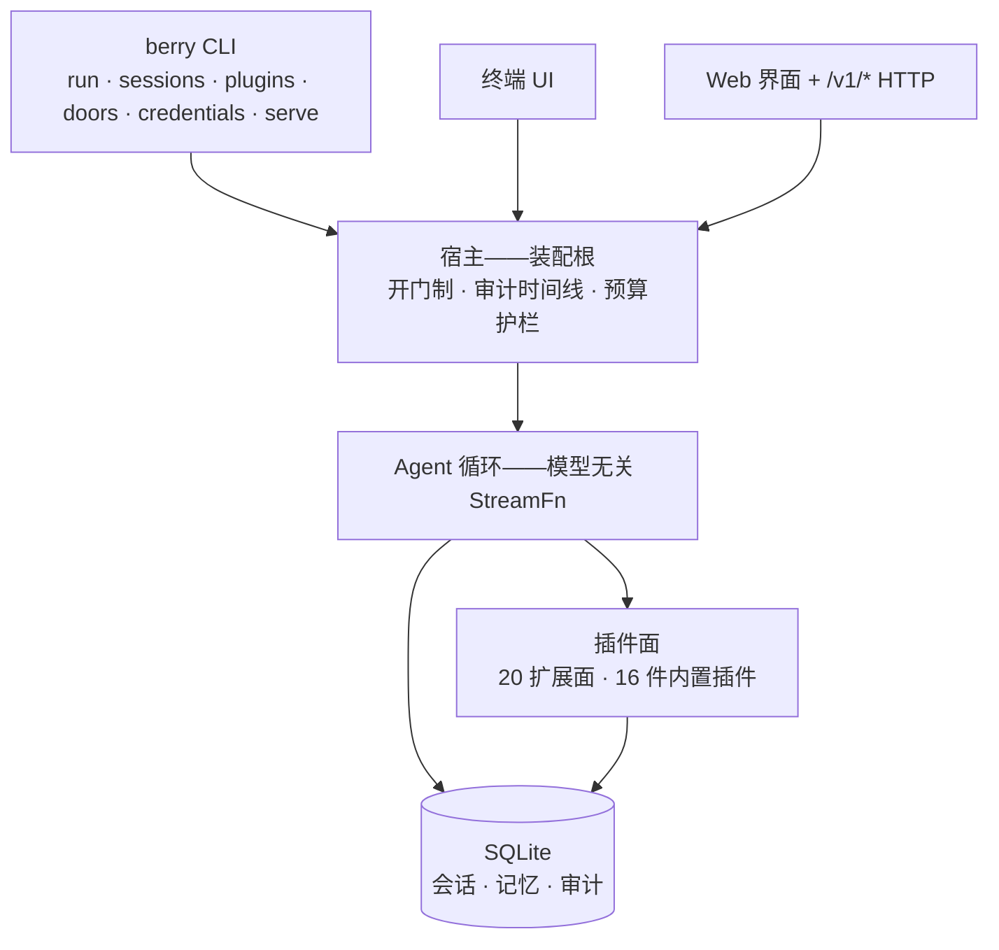

<div align="center">

# berry-agent

**AGI 时代的无人值守自动化运行 Agent——单一、可扩展的个人 Agent。**

对话与编码即本体。一切能力——shell、技能、浏览器、定时任务、记忆、Web 界面——
皆以**插件**装载；官方件与社区件走同一装载面，第一方无私有车道。

<p>
  <a href="https://www.npmjs.com/package/berry-agent"></a>
  <a href="https://github.com/miuiadmin/berry-agent/actions/workflows/ci.yml"></a>
  <a href="./LICENSE"></a>
  <a href="https://www.npmjs.com/package/berry-agent"></a>
  <a href="https://nodejs.org"></a>
  <a href="https://www.typescriptlang.org"></a>
</p>

<p>
  <a href="README.md">English</a> |
  <strong>简体中文</strong> |
  <a href="README.ko.md">한국어</a> |
  <a href="README.fr.md">Français</a> |
  <a href="README.es.md">Español</a> |
  <a href="README.ru.md">Русский</a>
</p>

**16** 件内置插件 · **28** 模块单向 DAG · **5,000+** 测试 ·
**6** 道机器验收发布契约 · **0** 遥测

> 状态：`0.1.0-alpha.6`——契约先行、逐批纵切落地；1.0 前 API 面仍可能调整。

</div>

---

## 为什么是 berry-agent

|                      |                                                                                                                                  |
| -------------------- | -------------------------------------------------------------------------------------------------------------------------------- |
| **为无人值守而生**   | 目标驱动的续跑——小时级 soak 实测、`kill -9` 硬杀后验证可恢复。降低人工干预，以 AI 全自动化为目标。                               |
| **一切皆插件**       | shell、技能、网络取数、定时任务、目标续跑、子代理、快照、记忆、MCP、LSP、浏览器、Web 界面……16 件官方能力与你的扩展走同一装载面。 |
| **开门制，不靠默契** | 危险能力一律坐在显式门后——`berry doors list` 逐门可见态；装得进不隐含权限，插件装机永不默认授权。                                |
| **模型无关**         | Anthropic、OpenAI、Google 等统一接入面。一个环境变量换模型，零代码改动、零锁定。                                                 |
| **会话可信**         | 每场会话落 SQLite——fork / resume / search / reindex；运行时断言「模型可见 ≡ 已记录」，看到即存下。                               |
| **三面自动化**       | TUI 驾驶、Web UI + `/v1/*` HTTP 监督、SDK 与 MCP 编程接入——一个 Agent，各类消费者通吃。                                          |
| **零遥测** | 无使用统计、无崩溃上报、外传零字节。缺省网络面 = 模型调用 + 你显式要的动作 + TUI 交互启动一次有界只读版本检查（24h 节流、env 一键归零），此外零。 |

## 快速开始

要求 Node.js ≥ 24。

```bash
# 不安装先试
npx berry-agent

# 全局安装
npm install -g berry-agent

# 或两段式安装脚本（先落盘再执行；不要用管道直灌，断流会让 shell 执行半截脚本）
curl -fsSL -o install.sh https://raw.githubusercontent.com/miuiadmin/berry-agent/main/scripts/install.sh
sh install.sh
```

装好后的命令是 **`berry`**：

```bash
berry                    # TUI：直进对话（按当前目录续接最新会话）
berry run "一句话单发"     # 单次执行 → stdout
berry sessions list      # 会话管理：list / resume / fork / search / reindex / export
berry plugins list       # 插件装机：list / check / install / uninstall / mount / unmount / toggle / update
berry credentials list   # 凭证管理：add / list / rm（TUI 另有 oauth 授权流）
berry doors list         # 开门制门态只读（开/关走 TUI /doors open|close）
berry serve --port 7860  # 常驻宿主（Web 界面 + /v1/* 程序调用面）
```

从 alpha.1 升级的用户：bin 已换代为 `berry`——净切、不留双名别名；npm 升级会把旧链 `berry-agent` 自动重链为 `berry`，旧命令名随之失效，脚本请改用 `berry`。

首启自动创建 `~/.berry-agent/`。模型缺省 `anthropic/claude-sonnet-5`（凭证按
provider 生态变量供给，如 `ANTHROPIC_API_KEY`），`BERRY_AGENT_MODEL` 可覆盖。
完整命令族、旗标、环境变量与 TUI 键位见[使用指南](./docs/usage.md)。

## 内置插件 16 件（随包出厂；15 件默认启用、可逐件禁用，core:issue 需配置后才装载）

| 插件               | 带来                              |
| ------------------ | --------------------------------- |
| `core:exec`        | shell 执行                        |
| `core:skills`      | 技能包（`SKILL.md`）              |
| `core:web`         | 网络取数                          |
| `core:scheduler`   | 定时任务                          |
| `core:goal`        | 目标续跑                          |
| `core:subagent`    | 子代理                            |
| `core:checkpoint`  | 边界快照 / rewind                 |
| `core:memory`      | 记忆                              |
| `core:mcp`         | MCP 客户端——挂载外部 MCP server   |
| `core:lsp`         | LSP 客户端——语言服务器智能        |
| `core:browser`     | 浏览器自动化                      |
| `core:webui`       | Web 界面                          |
| `core:sdk`         | 程序自动化通道                    |
| `core:obs`         | 观测                              |
| `core:issue`       | issue 驱动工作模式                |
| `core:credentials` | 凭证代管——env 注入与 OAuth 授权流 |

写你自己的插件：一份 manifest 加一个入口文件——见
[插件开发指南](./docs/plugin-development.md)与仓库随附的 [examples](./examples)。

## 自动化通道

- **HTTP**——`berry serve` 起常驻宿主：Web 界面 + 版本化、Bearer 鉴权的
  `/v1/*` JSON API；`serve --daemon` 后台运行（`serve status` / `serve stop`）。
- **SDK**——类型化 TypeScript 客户端（stdio spawn / 直连 HTTP 两传输）随仓库同源；
  `berry-agent-sdk` npm 包 alpha 档已上 npm（`npm install berry-agent-sdk` 即装）、随主仓演进。
- **MCP**——`berry mcp` 以 MCP server 形态暴露 Agent，任意 MCP 客户端可接入。

## 架构

机制在基座、策略在插件：宿主持有扩展点/钩子/事件/安全判据面，能力以插件表达。
28 模块构成单向 DAG——每一条依赖方向都由
[机器执法](./docs/architecture.md)（lint:topology 门禁）。



## 文档

| 册                                           | 内容                                 |
| -------------------------------------------- | ------------------------------------ |
| [架构总览](./docs/architecture.md)           | 分层、模块拓扑、运行时骨架、安全模型 |
| [使用指南](./docs/usage.md)                  | 安装、命令族、TUI、环境变量          |
| [插件开发指南](./docs/plugin-development.md) | manifest、ctx 能力面、扩展点、发布   |
| [开发指南](./docs/development.md)            | 门禁、拓扑律、测试纪律、贡献流程     |
| [运维手册](./docs/operations.md)             | 数据目录、备份恢复、故障排查         |

## 开发

```bash
npm install
npm run typecheck       # 门禁一：tsc --noEmit
npm test                # 门禁二：vitest run
npm run lint:topology   # 门禁三：模块 DAG + API 治理面 + 词汇查项门禁
npm run format:check    # 门禁四：prettier 检查
npm run build           # 构建链（webui → tsc → API 声明快照）
```

四门禁每次推送在 CI 全绿。参与贡献见[开发指南](./docs/development.md)与
[CONTRIBUTING](./CONTRIBUTING.md)；安全漏洞披露走 [SECURITY.md](./SECURITY.md)。

## License

[MIT](./LICENSE)
